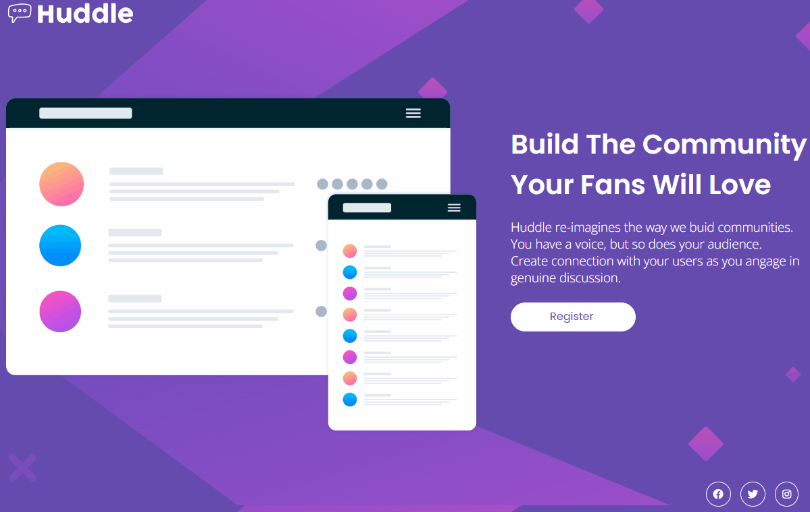

# Project Huddle landing Page.
 
  Project based on the challenge of the frontend mentor to create a website registration page.

# Challenge

My biggest difficulty was making it responsive.

# Design:

- Desktop:

- Mobile:

## Technologies used

- HTML
- CSS
